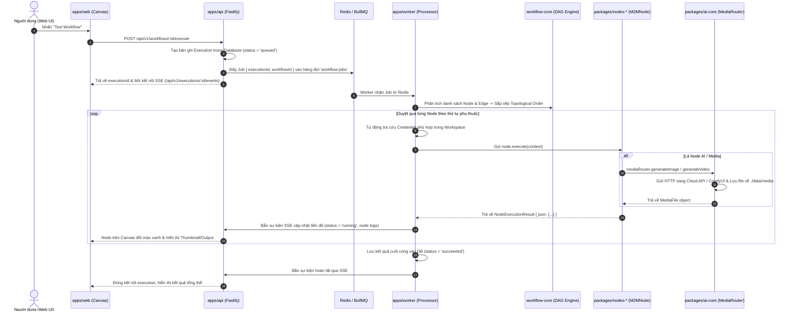

# Hướng dẫn Khởi đầu Dành cho Lập trình viên mới (Developer Onboarding Guide)
# m2m Automation Studio — Developer Documentation

Tài liệu này cung cấp cái nhìn toàn diện về kiến trúc hệ thống, cấu trúc mã nguồn, quy trình khởi chạy cục bộ, cách mở rộng tính năng (thêm Node, thêm AI Provider) và các quy chuẩn phát triển dành cho lập trình viên mới tham gia dự án **m2m Automation Studio**.

---

## 📑 Mục lục
1. [Tổng quan Dự án & Triết lý Thiết kế](#1-tổng-quan-dự-án--triết-lý-thiết-kế)
2. [Cấu trúc Monorepo & Phân tầng Mã nguồn](#2-cấu-trúc-monorepo--phân-tầng-mã-nguồn)
3. [Môi trường Phát triển & Khởi động Nhanh (Quickstart)](#3-môi-trường-phát-triển--khởi-động-nhanh-quickstart)
4. [Vòng đời Thực thi của Workflow (Execution Lifecycle)](#4-vòng-đời-thực-thi-của-workflow-execution-lifecycle)
5. [Hướng dẫn Tạo Node Mới (Custom Node Development)](#5-hướng-dẫn-tạo-node-mới-custom-node-development)
6. [Hệ thống Media Router & AI Cloud Providers](#6-hệ-thống-media-router--ai-cloud-providers)
7. [Cơ sở dữ liệu & Quản lý Thông tin xác thực (Credentials)](#7-cơ-sở-dữ-liệu--quản-lý-thông-tin-xác-thực-credentials)
8. [Quy chuẩn Phát triển, Typecheck & Quy tắc An toàn](#8-quy-chuẩn-phát-triển-typecheck--quy-tắc-an-toàn)

---

## 1. Tổng quan Dự án & Triết lý Thiết kế

**m2m (Max to Minus)** là nền tảng tự động hóa quy trình làm việc (Workflow Automation Engine) dạng kéo thả trực quan trên trình duyệt (tương tự như n8n / ComfyUI / Make), được tối ưu hóa chuyên sâu cho:
- **Tác vụ hệ thống & Logic tự động hóa:** HTTP Request, Cron Schedule, Webhook, JavaScript Sandboxing, Điều kiện rẽ nhánh (IF / Switch / Loop).
- **Trí tuệ nhân tạo (AI & LLMs):** Tích hợp Ollama (local), Google Gemini, OpenAI-compatible APIs (DeepSeek, ChatGPT, Qwen), Trích xuất JSON có cấu trúc (Structured Outputs), Vector Embeddings.
- **Pipeline Đồ họa & Điện ảnh AI đỉnh cao (Generative Media):** Tạo ảnh từ prompt, tạo video từ ảnh (Image-to-Video), chỉnh sửa ảnh (Inpainting với cọ vẽ Mask), Storyboard Splitter, ghép nối video. Hỗ trợ cả mô hình Local (ComfyUI với FLUX.2 Klein, Wan2.2 TI2V-5B) và các nhà cung cấp Cloud hàng đầu (SiliconCloud, Zhipu AI, Alibaba DashScope, Cloudflare Workers AI, Pollinations, Hugging Face, Black Forest Labs).

---

## 2. Cấu trúc Monorepo & Phân tầng Mã nguồn

Dự án được tổ chức theo cấu trúc **pnpm Workspace Monorepo**, chia làm 3 ứng dụng chính (`apps/`) và 9 thư viện dùng chung (`packages/`):

```
m2m/
├── apps/
│   ├── api/             # Backend Fastify REST API, Swagger/OpenAPI, SSE execution streaming
│   ├── web/             # Frontend Vue 3 + Vite + Pinia + VueFlow (Canvas trực quan)
│   └── worker/          # BullMQ queue worker, DAG runner, Media pipeline runner
│
├── packages/
│   ├── ai-core/         # Media Router, Cloud Providers Adapter, Quản lý File Media & Storage
│   ├── config/          # Quản lý cấu hình môi trường (.env), biến cấu hình dùng chung
│   ├── database/        # Drizzle ORM, SQLite/Better-SQLite3 schemas, Repositories, Migrations
│   ├── node-sdk/        # Core Node Interfaces (M2MNode, ExecutionContext, NodeMetadata)
│   ├── nodes-ai/        # Tập hợp các khối AI & Media Generation (LLM, Image, Video, Inpaint)
│   ├── nodes-base/      # Tập hợp các khối xử lý cốt lõi (HTTP, Code, Schedule, Webhook, IF)
│   ├── queue/           # BullMQ & Redis connection wrapper, định nghĩa Job Queue
│   ├── shared/          # Kiểu dữ liệu TypeScript, Schemas, Error Classes (M2MError)
│   └── workflow-core/   # Bộ xử lý đồ thị DAG (Topological Sorting), Expression Parser
│
├── docs/                # Toàn bộ tài liệu kỹ thuật, hướng dẫn sử dụng, setup media
└── run-servers.bat      # Script khởi động trọn gói 1-click trên môi trường Windows
```

### Chi tiết vai trò từng thành phần:

| Package / App | Công nghệ chính | Nhiệm vụ cốt lõi |
| :--- | :--- | :--- |
| **`apps/api`** | Fastify, TypeScript | Tiếp nhận request từ Web, quản lý Workspaces, Workflows, Credentials, kích hoạt chạy Workflow, stream trạng thái thực thi qua Server-Sent Events (SSE). |
| **`apps/web`** | Vue 3, Vite, VueFlow, Pinia | Giao diện đồ họa kéo thả Node, chỉnh sửa cấu hình thông số, xem trực tiếp Thumbnail/Video trên Canvas, công cụ Inpainting Mask Editor. |
| **`apps/worker`** | BullMQ, Node.js, tsx | Lắng nghe hàng đợi Redis, phân tích thứ tự thực thi đồ thị DAG, gọi hàm `execute()` của từng Node, tự động giải mã thông tin xác thực (Credentials). |
| **`packages/ai-core`** | Fetch API, File Storage | Điều phối yêu cầu tạo ảnh/video đến đúng Provider (`SiliconFlow`, `Zhipu`, `DashScope`, `Cloudflare`, `Pollinations`, `ComfyUI`, `HuggingFace`), lưu trữ file media về `./data/media/`. |
| **`packages/workflow-core`**| TypeScript DAG Engine | Sắp xếp topo (Kahn's algorithm), phân giải biểu thức `{{ $json.field }}`, kiểm tra tính hợp lệ của liên kết giữa các Node. |
| **`packages/node-sdk`** | TypeScript Interface | Khung chuẩn cho việc định nghĩa Node (`M2MNode`, `NodeMetadata`, `NodeExecutionContext`, `NodeExecutionResult`). |

---

## 3. Môi trường Phát triển & Khởi động Nhanh (Quickstart)

### 3.1. Yêu cầu hệ thống
- **Node.js**: Phiên bản `20.x` trở lên.
- **Trình quản lý gói**: `pnpm` phiên bản `9.x` hoặc `10.x` (`npm install -g pnpm`).
- **Docker Desktop**: Cần thiết để khởi chạy container **Redis** (dùng cho BullMQ Queue).
- **Hệ điều hành**: Windows 10/11, macOS, hoặc Linux.

### 3.2. Cài đặt các gói phụ thuộc
Tại thư mục gốc của dự án:
```bash
pnpm install
```

### 3.3. Cấu hình biến môi trường (`.env`)
Sao chép file mẫu `.env.example` thành `.env`:
```bash
cp .env.example .env
```
Nội dung cơ bản của file `.env`:
```env
PORT=3000
NODE_ENV=development
API_PORT=3000
WEB_PORT=5173
DATABASE_URL=./data/m2m.db
REDIS_HOST=localhost
REDIS_PORT=6379
MEDIA_STORAGE_PATH=./data/media
```

### 3.4. Khởi động hệ thống

#### Cách 1: Khởi động 1-Click trên Windows (Khuyên dùng)
Chạy file script:
```cmd
run-servers.bat
```
Script sẽ tự động:
1. Kiểm tra và khởi động **Docker Desktop**.
2. Bật container **Redis** (`redis:7-alpine`).
3. Khởi chạy đồng thời 3 cửa sổ console:
   - **API Server** (Port `3000`): `http://localhost:3000`
   - **Web UI** (Port `5173`): `http://localhost:5173`
   - **Worker Service**: Lắng nghe và xử lý tác vụ nền

#### Cách 2: Khởi động thủ công bằng lệnh terminal
- Khởi động Redis bằng Docker:
  ```bash
  docker run -d --name m2m-redis -p 6379:6379 redis:7-alpine
  ```
- Khởi động toàn bộ các dịch vụ (API, Worker, Web):
  ```bash
  pnpm dev
  ```

---

## 4. Vòng đời Thực thi của Workflow (Execution Lifecycle)

Khi người dùng nhấn nút **"Execute / Test Workflow"** trên giao diện Web hoặc khi có Webhook / Cron kích hoạt, quy trình diễn ra như sau:



---

## 5. Hướng dẫn Tạo Node Mới (Custom Node Development)

Để thêm một khối xử lý mới vào hệ thống, hãy làm theo các bước chuẩn sau:

### Bước 1: Tạo file Node mới
Tạo file trong `packages/nodes-base/src/` (nếu là tác vụ hệ thống) hoặc `packages/nodes-ai/src/` (nếu là tác vụ AI).

Ví dụ tạo file `packages/nodes-base/src/text-transformer-node.ts`:
```ts
import type { M2MNode, NodeExecutionContext, NodeExecutionResult, NodeMetadata } from '@m2m/node-sdk';
import { M2MError } from '@m2m/shared';

export class TextTransformerNode implements M2MNode {
  readonly type = 'core.textTransformer';
  readonly version = 1;

  // Metadata định nghĩa cách Node hiển thị trên Canvas & thanh cài đặt bên phải
  readonly metadata: NodeMetadata = {
    type: this.type,
    version: 1,
    displayName: 'Text Transformer',
    category: 'core',
    icon: 'type',
    inputs: 1,
    outputs: 1,
    description: 'Chuyển đổi chuỗi văn bản thành chữ hoa, chữ thường hoặc loại bỏ khoảng trắng.',
    properties: [
      {
        name: 'mode',
        displayName: 'Transform Mode',
        type: 'select',
        required: true,
        default: 'uppercase',
        options: [
          { label: 'CHỮ HOA (UPPERCASE)', value: 'uppercase' },
          { label: 'chữ thường (lowercase)', value: 'lowercase' },
          { label: 'Cắt khoảng trắng (Trim)', value: 'trim' }
        ]
      },
      {
        name: 'text',
        displayName: 'Input Text',
        type: 'string',
        required: true,
        default: '{{ $json.text }}',
        description: 'Văn bản cần biến đổi hoặc biểu thức lấy từ bước trước'
      }
    ]
  };

  // Logic thực thi của Node
  async execute(context: NodeExecutionContext): Promise<NodeExecutionResult> {
    const { node } = context;
    const mode = String(node.parameters.mode || 'uppercase');
    const inputText = String(node.parameters.text || '');

    if (!inputText) {
      throw new M2MError('VALIDATION_ERROR', 'Input text must not be empty', false);
    }

    let resultText = inputText;
    switch (mode) {
      case 'uppercase':
        resultText = inputText.toUpperCase();
        break;
      case 'lowercase':
        resultText = inputText.toLowerCase();
        break;
      case 'trim':
        resultText = inputText.trim();
        break;
    }

    // Trả về dữ liệu dưới dạng JSON object để truyền tiếp cho các node sau
    return {
      json: {
        original: inputText,
        transformed: resultText,
        mode
      }
    };
  }
}
```

### Bước 2: Đăng ký Node vào NodeRegistry
Mở file `packages/nodes-base/src/index.ts` (hoặc `packages/nodes-ai/src/index.ts`):
```ts
import { TextTransformerNode } from './text-transformer-node.js';

export function registerBaseNodes(registry: NodeRegistry) {
  // ... các node hiện có ...
  registry.register(new TextTransformerNode());
}
```

### Bước 3: Tương thích tức thì trên Frontend Canvas
Frontend (`apps/web`) tự động lấy danh mục Node từ backend Fastify API `/api/v1/nodes` và hiển thị trên thanh tìm kiếm của Canvas mà bạn **không cần phải sửa đổi thêm mã Vue**.

---

## 6. Hệ thống Media Router & AI Cloud Providers

Tất cả các tác vụ sinh ảnh và video đều đi qua bộ điều phối trung tâm **`MediaRouter`** (`packages/ai-core/src/media/router.ts`).

### 6.1. Danh sách các Nhà cung cấp Media hiện có:
- **SiliconCloud (`siliconflow`):** Hỗ trợ `black-forest-labs/FLUX.1-schnell`, `FLUX.1-dev`, `Qwen/Qwen-Image`, `Tongyi-MAI/Z-Image-Turbo`, `Wan2.2-I2V-A14B`, `Wan2.1-I2V`.
- **Zhipu AI (`zhipu`):** Hỗ trợ `CogView-3-Plus`, `CogView-4`, `CogVideoX-Flash` (Free tier).
- **Alibaba DashScope (`dashscope`):** Hỗ trợ `Wanx 2.1 T2I Turbo`, `Wanx 2.1 I2V Turbo`.
- **Cloudflare Workers AI (`cloudflare`):** Hỗ trợ `@cf/black-forest-labs/flux-1-schnell`, `stable-diffusion-xl-lightning` (Miễn phí 10,000 neurons/ngày).
- **Pollinations.ai (`pollinations`):** Tạo ảnh FLUX miễn phí 100%, không giới hạn và không cần API Key.
- **Hugging Face (`huggingface`):** Hỗ trợ `black-forest-labs/FLUX.1-schnell`, `LTX-Video`.
- **ComfyUI Local (`comfyui`):** Chạy trực tiếp trên GPU máy tính cục bộ qua API WebSocket.

### 6.2. Thêm một Cloud Media Provider mới
Tất cả các adapter provider đều phải kế thừa interface `MediaProviderAdapter` trong `packages/ai-core/src/types.ts`:

```ts
export interface MediaProviderAdapter {
  readonly id: string;
  getProviderInfo(): MediaProviderInfo;
  health(credential?: ResolvedMediaCredential): Promise<boolean>;
  listModels(): Promise<MediaModel[]>;
  generateImage?(request: ImageGenerationRequest, credential?: ResolvedMediaCredential, onProgress?: (progress: number) => void): Promise<MediaFile[]>;
  generateVideo?(request: VideoGenerationRequest, credential?: ResolvedMediaCredential, onProgress?: (progress: number) => void): Promise<MediaFile>;
  editImage?(request: ImageEditRequest, credential?: ResolvedMediaCredential, onProgress?: (progress: number) => void): Promise<MediaFile[]>;
}
```

---

## 7. Cơ sở dữ liệu & Quản lý Thông tin xác thực (Credentials)

### 7.1. Cấu trúc Database (Drizzle ORM)
Cơ sở dữ liệu SQLite nằm tại `./data/m2m.db`. Bảng dữ liệu bao gồm:
- `workspaces`: Không gian làm việc đa người dùng.
- `workflows`: Định nghĩa đồ thị quy trình (các nodes, edges, settings).
- `executions`: Lịch sử các lượt chạy (thời gian bắt đầu, kết thúc, trạng thái, kết quả từng node).
- `credentials`: Lưu trữ API Key, Token được mã hóa an toàn theo từng Provider Type.
- `audit_logs`: Nhật ký kiểm tra hoạt động bảo mật.

### 7.2. Tự động nhận diện Credential theo Workspace (Smart Auto-Resolution)
Trong `apps/worker/src/processor.ts`, nếu một Node AI hoặc Media không được gắn thủ công ID Credential, hệ thống sẽ **tự động truy vấn database tìm Credential phù hợp với loại Provider trong Workspace hiện tại** để thực thi, giúp người dùng không phải chọn lại credential thủ công mỗi khi tạo node.

---

## 8. Quy chuẩn Phát triển, Typecheck & Quy tắc An toàn

### 8.1. Kiểm tra Kiểu dữ liệu (Bắt buộc trước khi Commit)
Trước khi tạo Pull Request hoặc hoàn tất tính năng, bắt buộc phải chạy lệnh kiểm tra TypeScript trên toàn bộ 12 projects trong monorepo:
```bash
pnpm typecheck
```
Để kiểm tra riêng từng package:
```bash
pnpm --filter @m2m/ai-core typecheck
pnpm --filter @m2m/nodes-ai typecheck
pnpm --filter @m2m/web typecheck
```

### 8.2. Build thử nghiệm Frontend
```bash
pnpm --filter @m2m/web build
```

### 8.3. ⚠️ QUY TẮC AN TOÀN BẮT BUỘC (MANDATORY AGENT RULES)

1. **Tuyệt đối KHÔNG tự ý khởi chạy Kiểm thử tự động (No Unrequested Automated Testing):**
   - Không được tự ý khởi tạo Playwright, Puppeteer, Selenium hoặc chạy Browser Subagent nếu chưa có yêu cầu trực tiếp và rõ ràng từ người dùng.
2. **Tuyệt đối KHÔNG tự ý Push lên nhánh `main` (No Unrequested Push to Main):**
   - Không thực hiện `git push origin main`. Nhánh `main` được kết nối với hệ thống CI/CD triển khai tự động lên Railway.app, việc tự ý push sẽ tiêu tốn tài nguyên và làm gián đoạn môi trường sản phẩm.
3. **Phân tích Tác động trước khi sửa Symbol (GitNexus Code Intelligence):**
   - Trước khi sửa một hàm, class hoặc method quan trọng, hãy dùng công cụ `gitnexus` để phân tích tầm ảnh hưởng:
     ```
     impact({ target: "Tên_Symbol", direction: "upstream" })
     ```

---

*Tài liệu được cập nhật tự động bởi Antigravity Engine — m2m Automation Studio.*
